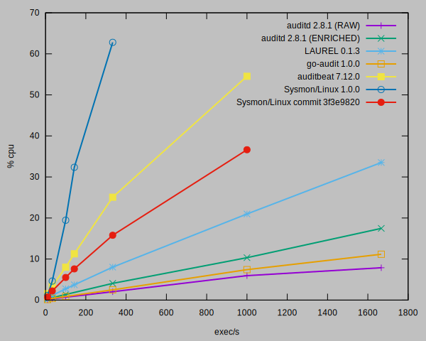

# _LAUREL_ Performance

While _LAUREL_ was written with performance in mind, running it on busy systems with audit rule sets that actually produce log entries does incur some CPU overhead. 

We have conducted benchmarks of _LAUREL_ against _auditd_ and several other tools. A load generator that spawns trivial processes (`/bin/true`) at a set frequency was used to generate load and CPU time (system+user) for all processes involved was measured. The number of exec events per second was chosen due to our experience with systems where hundreds of processes are spawned during regular operation. A custom tool, [edr-loadgen](https://github.com/hillu/edr-loadgen), was written for this task.

As can be seen in the graph CPU consumption by _auditd(8)_, its event dispatcher, and _LAUREL_ combined is about twice as high as with a plain _auditd(8)_ setup using the `log_format=ENRICHED` configuration option. We still see several oppurtunities for improvements.

All measurements involving the Linux audit framework were conducted on an AWS EC2 t2.small instance running Amazon Linunx 2. Since Sysmon for Linux does not (yet?) support that distribution's kernel version, it was tested on Ubuntu 20.04.

## Notes

1. CPU usage for all user-space processes that are involved in collecting and emitting events was measured. In _LAUREL's_ case, this included _auditd_ and _audispd_. Sysmon for Linux writes its events through _systemd-journald(8)_, so its CPU usage also had to be taken into account. Both _go-audit_ and _auditbeat_ are replacements for _auditd_ that directly consume events from the kernel, so CPU usage had to be recorded only for one process.
2. The numbers for Sysmon for Linux should be taken with a grain of salt since the experiments conducted so far only took CPU usage into account that was directly attributed to user-space processes. We are open to suggestions on how to compare the kernel/user interface for the Linux audit framework to the eBPF probes used by Sysmon.
3. The log file produced by [_go-audit_](https://github.com/slackhq/go-audit) is JSONL-based which might lead to the conclusion that replacing  _auditd_ with _go-audit_ might be a good choice. However _go-audit_ solves only one of the log format quirks described in [Practical _auditd(8)_ problems](practical-auditd-problems.md)  and does not even perform all of the translations that _auditd_ does when configured with `log_format=ENRICHED`.

## Raw data

The data is can be found in the `contrib/performacne-data` subdirectory.

